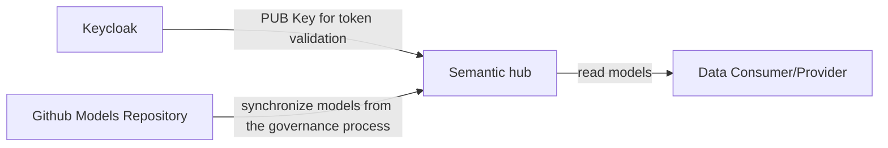

## 2 Architecture and constraints

### Overall Architecture
The SLDT Semantic Hub stores Semantic Model definitions and allows the generation of several artifacts. It restricts access to the models by authentication via a token and authorization via roles in the token claims. Therefore, the Hub interacts with a Keycloak instance. The models are created in the Hub during our governance process as depicted below.

### NOTICE

This work is licensed under the [Apache-2.0](https://www.apache.org/licenses/LICENSE-2.0).

- SPDX-License-Identifier: Apache-2.0
- SPDX-FileCopyrightText: 2023 Robert Bosch Manufacturing Solutions GmbH
- SPDX-FileCopyrightText: 2023 Contributors to the Eclipse Foundation
- Source URL: https://github.com/eclipse-tractusx/sldt-semantic-hub.git