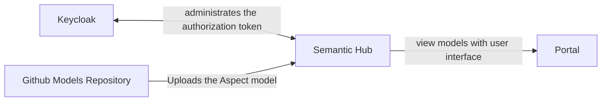
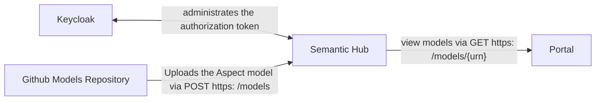

## 3 System scope and context

### Business Context

| Neighbor                 | Description                                                         | Example                                                  |
|--------------------------|---------------------------------------------------------------------|----------------------------------------------------------|
| Github Models Repository | Uploads aspect model on Semantic hub with some urn                  | A provider/use case uploads model with urn model-1.0.    |
| Semantic Hub             | Provides the endpoints to view, add, update or delete aspect models |                                                          |
| Keycloak                 | Keycloak is used for token validation                               |                                                          |
| Portal                   | User interface used to view aspect models                           |

### Technical Context

| Neighbor                 | Description                                                              |
|--------------------------|--------------------------------------------------------------------------|
| Github Models Repository | Uploads or modify models in Semantic Hub                                 |
| Portal                   | Views the Aspect Models through user interface                           |
| Keycloak                 | Generates token for users and provides id management of user and service |

### NOTICE

This work is licensed under the [Apache-2.0](https://www.apache.org/licenses/LICENSE-2.0).

- SPDX-License-Identifier: Apache-2.0
- SPDX-FileCopyrightText: 2023 Robert Bosch Manufacturing Solutions GmbH
- SPDX-FileCopyrightText: 2023 Contributors to the Eclipse Foundation
- Source URL: https://github.com/eclipse-tractusx/sldt-semantic-hub.git