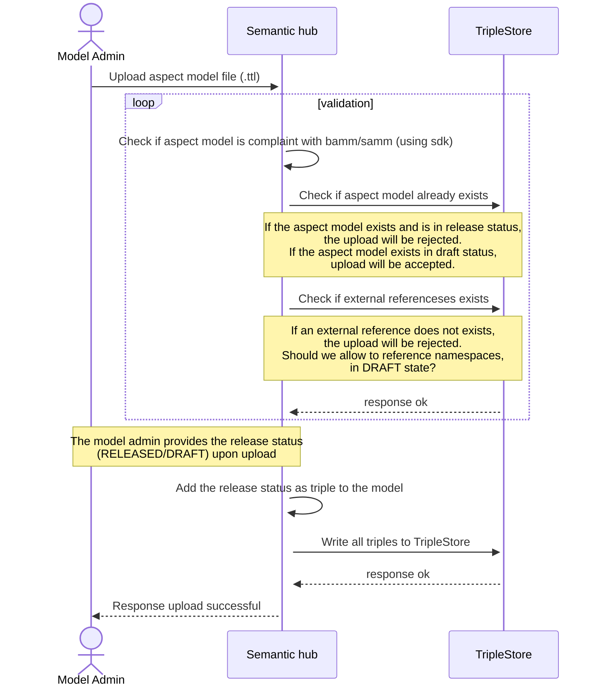
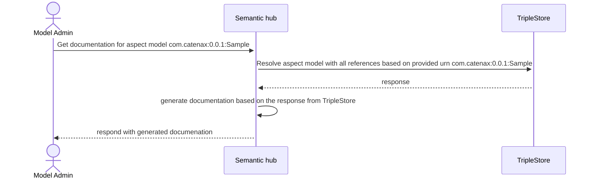

## 4 Runtime-view

### Upload of an aspect model

| Validation | Description Value | 
|---|---|
| BAMM compliance  | Checks if the model is compliant with the BAMM. The BAMM SDK does provide the validation logic. |
| Model Status check (RELEASE vs DRAFT)  | Uploads will always accepted when there are no existing namespace:version combination in the TripleStore. For a model in DRAFT state, uploads will always be accepted. For a model in RELEASE state, uploads will be denied. RELEASED models are immutable. |
|  External reference check | It will be checked if all exernal references are available in the TripleStore. The BAMM SDK does provide a mechanisim where the resolving against the TripleStore can be integrated. |


## Download of the documentation of an Aspect Model

```

Example queries to resolve an aspect model with all references:
Construct Query
```
@prefix ns: <urn:bamm:org.idtwin:1.0.0#DocumentationSimple>

CONSTRUCT {
?s ?p ?o .
} WHERE {
bind( ns: as ?aspect)
?aspect (<>|!<>)* ?s . // resolves all references
?s ?p ?o .
}
Search for Aspect Models
The current search API can stay as is. Below is an example query for selecting bamm properties:
Search Queries
CONSTRUCT {
?s ?p ?o .
} WHERE {   
FILTER ( $param == ?o )  // Custom filter can be added here.
?s ?p ?o .
}


### NOTICE

This work is licensed under the [Apache-2.0](https://www.apache.org/licenses/LICENSE-2.0).

- SPDX-License-Identifier: Apache-2.0
- SPDX-FileCopyrightText: 2023 Robert Bosch Manufacturing Solutions GmbH
- SPDX-FileCopyrightText: 2023 Contributors to the Eclipse Foundation
- Source URL: https://github.com/eclipse-tractusx/sldt-semantic-hub.git