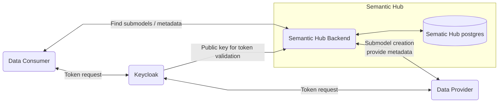

## 6 Concept

### Overall Concept

#The overall concept can be found under **2 Architecture and
constraints**.

### Semantic Hub

Example Aspect Model
```
@prefix xsd: <http://www.w3.org/2001/XMLSchema#> .
@prefix bamm: <urn:bamm:io.openmanufacturing:meta-model:1.0.0#> .
@prefix : <urn:bamm:org.idtwin:1.0.0#> .


:DocumentationSimple a bamm:Aspect;
bamm:name "ManufacturerDocumentationSimple";
bamm:preferredName "ManufacturerDocumentation"@en;
bamm:description "The Submodel defines a simplified set of manufacturer documentation to bring about information from manufacturer to operator of industrial equipment."@en;

:documents a bamm:Property;
bamm:name "documents";
bamm:preferredName "documents"@en;
bamm:description "Set of documents"@en;
```

The Semantic Hub will add the release status as triple upon upload:
Release Status
```
@prefix aux: <urn:bamm:io.openmanufacturing:aspect-model:aux#>

<urn:bamm:org.idtwin:1.0.0#> aux:releaseStatus aux:DRAFT .
```

### Package
| No | Rule                                                                                                              | Example                                                                                                                                                                                                                                                                                                                                                                                                                                                                                                               |
|----|-------------------------------------------------------------------------------------------------------------------|-----------------------------------------------------------------------------------------------------------------------------------------------------------------------------------------------------------------------------------------------------------------------------------------------------------------------------------------------------------------------------------------------------------------------------------------------------------------------------------------------------------------------|
| 1. | A package is defined by the urn prefix until "#".                                                                 | net.catenax.semantics.product:1.2.0#                                                                                                                                                                                                                                                                                                                                                                                                                                                                                  |
| 2. | A package can contain one or multiple aspects.                                                                    | Example 1: net.catenax.semantics.traceability:1.2.0#Traceability Example 2: net.catenax.semantics.product:1.2.0#ProductDescription net.catenax.semantics.product:1.2.0#ProductUsage net.catenax.semantics.product:1.2.0#ProductDetails                                                                                                                                                                                                                                                                                |
| 3. | Multiple versions of a package can exists.                                                                        | Possible: net.catenax.semantics.product:1.2.0 net.catenax.semantics.product:4.2.0                                                                                                                                                                                                                                                                                                                                                                                                                                     |
| 4. | The versioning applies to the package.  All aspects and model elements scoped to a package have the same version. | Possible: net.catenax.semantics.product:1.2.0#ProductDescription  net.catenax.semantics.product:1.2.0#ProductUsage net.catenax.semantics.product:1.2.0#ProductDetails  Possible:net.catenax.semantics.product:4.3.0#ProductDescription  net.catenax.semantics.product:4.3.0#ProductUsage net.catenax.semantics.product:4.3.0#ProductDetails  Not Possible: net.catenax.semantics.product:1.3.0#ProductDescription net.catenax.semantics.product:1.2.0#ProductUsage net.catenax.semantics.product:3.2.0#ProductDetails |
| 5. | All aspect models and model elements scoped to a package have the same status.                                    | Possible: net.catenax.semantics.product:1.2.0#ProductDescription → RELEASE, net.catenax.semantics.product:1.2.0#ProductUsage → RELEASE net.catenax.semantics.product:1.2.0#ProductDetails → RELEASE Not Possible: net.catenax.semantics.product:1.2.0#ProductDescription → RELEASE, net.catenax.semantics.product:1.2.0#ProductUsage → DRAFT                                                                                                                                                                          |


### Security / Safety / Use of JWT Token

The whole environment is secured with OAuth2. We used and recommend the usage of Keycloak. The Semantic hub has
a realm entry in Keycloak. Every user who wants to use Semantic Hub
need the corresponding roles for his user.

The roles are:

1. [ ] *VIEW*( "view_semantic_model" )
2. [ ] *ADD*( "add_semantic_model" )
3. [ ] *DELETE*( "delete_semantic_model" )
4. [ ] *UPDATE*( "update_semantic_model" )
These roles are sent within a JWT Token generated by Keycloak.

With Add,Delete,Update roles it is possible to add or modify entries from the
Semantic Hub Database. For searching the view role is sufficient.
The credentials are set with entries in Helm Charts.

### Authentication & Authorization
The service is secured by a OAuth2 compliant authorization. Every API call has to provide a
valid Bearer Token. Authorization is provided by a role based access. These roles are possible:

| Role                    | Description                   |
|-------------------------|-------------------------------|
| view_semantic_model     | can search for semantic model |
| add_semantic_model      | can add semantic model        |
| delete_semantic_model   | can delete semantic model     |
| update_semantic_model   | can update semantic model     |


### Security Assessment

### Data Flow Diagram




### NOTICE

This work is licensed under the [Apache-2.0](https://www.apache.org/licenses/LICENSE-2.0).

- SPDX-License-Identifier: Apache-2.0
- SPDX-FileCopyrightText: 2023 Robert Bosch Manufacturing Solutions GmbH
- SPDX-FileCopyrightText: 2023 Contributors to the Eclipse Foundation
- Source URL: https://github.com/eclipse-tractusx/sldt-semantic-hub.git