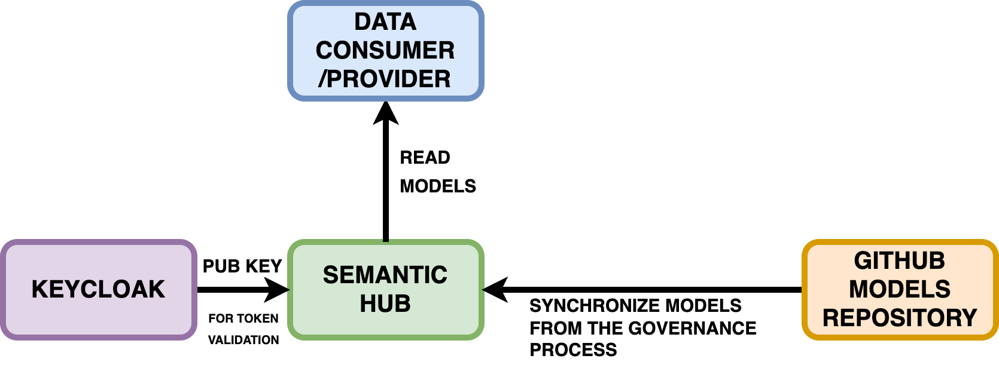
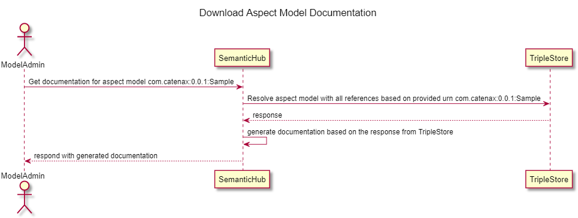

## Architectural Overview
The SLDT Semantic Hub stores Semantic Model definitions and allows the generation of several artifacts. It restricts access to the models by authentication via a token and authorization via roles in the token claims. Therefore, the Hub interacts with a Keycloak instance. The models are created in the Hub during our governance process as depicted below.



## Implementation
The following section describes the use cases implemented for the semantic hub.

### Upload of an aspect model


| Validation | Description Value | 
|---|---|
| BAMM compliance  | Checks if the model is compliant with the BAMM. The BAMM SDK does provide the validation logic. |
| Model Status check (RELEASE vs DRAFT)  | Uploads will always accepted when there are no existing namespace:version combination in the TripleStore. For a model in DRAFT state, uploads will always be accepted. For a model in RELEASE state, uploads will be denied. RELEASED models are immutable. |
|  External reference check | It will be checked if all exernal references are available in the TripleStore. The BAMM SDK does provide a mechanisim where the resolving against the TripleStore can be integrated. |


## Example:
Example Aspect Model
```
@prefix xsd: <http://www.w3.org/2001/XMLSchema#> .
@prefix bamm: <urn:bamm:io.openmanufacturing:meta-model:1.0.0#> .
@prefix : <urn:bamm:org.idtwin:1.0.0#> .


:DocumentationSimple a bamm:Aspect;
bamm:name "ManufacturerDocumentationSimple";
bamm:preferredName "ManufacturerDocumentation"@en;
bamm:description "The Submodel defines a simplified set of manufacturer documentation to bring about information from manufacturer to operator of industrial equipment."@en;

:documents a bamm:Property;
bamm:name "documents";
bamm:preferredName "documents"@en;
bamm:description "Set of documents"@en;
```

The Semantic Hub will add the release status as triple upon upload:
Release Status
```
@prefix aux: <urn:bamm:io.openmanufacturing:aspect-model:aux#>

<urn:bamm:org.idtwin:1.0.0#> aux:releaseStatus aux:DRAFT .
```

## Package
| No | Rule                                                                                                              | Example                                                                                                                                                                                                                                                                                                                                                                                                                                                                                                               |
|----|-------------------------------------------------------------------------------------------------------------------|-----------------------------------------------------------------------------------------------------------------------------------------------------------------------------------------------------------------------------------------------------------------------------------------------------------------------------------------------------------------------------------------------------------------------------------------------------------------------------------------------------------------------|
| 1. | A package is defined by the urn prefix until "#".                                                                 | net.catenax.semantics.product:1.2.0#                                                                                                                                                                                                                                                                                                                                                                                                                                                                                  |
| 2. | A package can contain one or multiple aspects.                                                                    | Example 1: net.catenax.semantics.traceability:1.2.0#Traceability Example 2: net.catenax.semantics.product:1.2.0#ProductDescription net.catenax.semantics.product:1.2.0#ProductUsage net.catenax.semantics.product:1.2.0#ProductDetails                                                                                                                                                                                                                                                                                |
| 3. | Multiple versions of a package can exists.                                                                        | Possible: net.catenax.semantics.product:1.2.0 net.catenax.semantics.product:4.2.0                                                                                                                                                                                                                                                                                                                                                                                                                                     |
| 4. | The versioning applies to the package.  All aspects and model elements scoped to a package have the same version. | Possible: net.catenax.semantics.product:1.2.0#ProductDescription  net.catenax.semantics.product:1.2.0#ProductUsage net.catenax.semantics.product:1.2.0#ProductDetails  Possible:net.catenax.semantics.product:4.3.0#ProductDescription  net.catenax.semantics.product:4.3.0#ProductUsage net.catenax.semantics.product:4.3.0#ProductDetails  Not Possible: net.catenax.semantics.product:1.3.0#ProductDescription net.catenax.semantics.product:1.2.0#ProductUsage net.catenax.semantics.product:3.2.0#ProductDetails |
| 5. | All aspect models and model elements scoped to a package have the same status.                                    | Possible: net.catenax.semantics.product:1.2.0#ProductDescription → RELEASE, net.catenax.semantics.product:1.2.0#ProductUsage → RELEASE net.catenax.semantics.product:1.2.0#ProductDetails → RELEASE Not Possible: net.catenax.semantics.product:1.2.0#ProductDescription → RELEASE, net.catenax.semantics.product:1.2.0#ProductUsage → DRAFT                                                                                                                                                                          |

## Download of the documentation of an Aspect Model


Example queries to resolve an aspect model with all references:
Construct Query
```
@prefix ns: <urn:bamm:org.idtwin:1.0.0#DocumentationSimple>

CONSTRUCT {
?s ?p ?o .
} WHERE {
bind( ns: as ?aspect)
?aspect (<>|!<>)* ?s . // resolves all references
?s ?p ?o .
}
Search for Aspect Models
The current search API can stay as is. Below is an example query for selecting bamm properties:
Search Queries
CONSTRUCT {
?s ?p ?o .
} WHERE {   
FILTER ( $param == ?o )  // Custom filter can be added here.
?s ?p ?o .
}
```

### NOTICE

This work is licensed under the [Apache-2.0](https://www.apache.org/licenses/LICENSE-2.0).

- SPDX-License-Identifier: Apache-2.0
- SPDX-FileCopyrightText: 2023 Robert Bosch Manufacturing Solutions GmbH
- SPDX-FileCopyrightText: 2023 Contributors to the Eclipse Foundation
- Source URL: https://github.com/eclipse-tractusx/sldt-semantic-hub.git